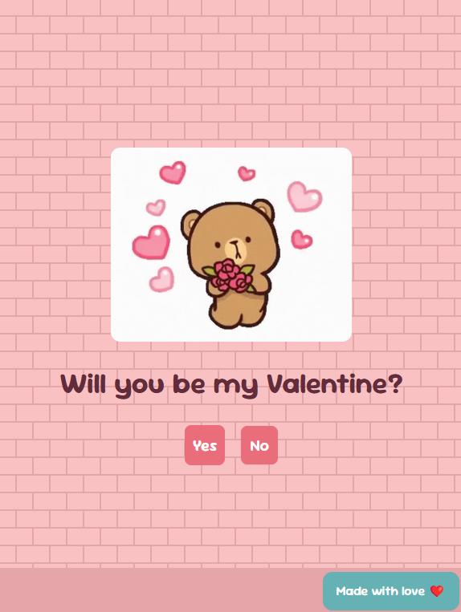

# ❤️ Will You Be My Valentine? 💌

A sweet and simple interactive website to ask the big question: **Will you be my Valentine?**

## ✨ Features

- A heartwarming UI with cute animations
- "Yes" button grows in size with each click
- "No" button cycles through different playful responses
- A celebratory animation when "Yes" is selected
- Fully responsive design

## 🛠️ Technologies Used

- **Next.js** – for a modern React framework
- **React Hooks** – for managing state
- **Tailwind CSS** – for styling
- **DaisyUI** – for UI components
- **GIFs** – for extra cuteness 🥰

## 📸 Preview



## 🚀 Getting Started

### 1️⃣ Clone the Repository

```sh
git clone https://github.com/BossNattawat/Valentine.git
cd Valentine
```

### 2️⃣ Install Dependencies

```sh
npm install
```

### 3️⃣ Run the App

```sh
npm run dev
```

The website will be available at: **`http://localhost:3000`**

## 📂 File Structure

```
📂 valentine-app
├── 📁 public          # Store static assets (favicons, images, etc.)
│   ├── 📁 screenshot  # Store project screenshots
│   ├── ❤️ favicon.ico
├── 📁 components      # Reusable components
├── 📁 data            # Array of playful "No" responses
├── 📄 page.jsx        # Main Valentine proposal page
├── 📄 README.md       # Project documentation
└── 📄 package.json    # Dependencies and scripts
```

## 🥰 Contributing

Want to improve the experience? Feel free to fork and submit a PR!

## 🎉 Acknowledgments

Special thanks to **you** for making someone's day extra special! 💖
